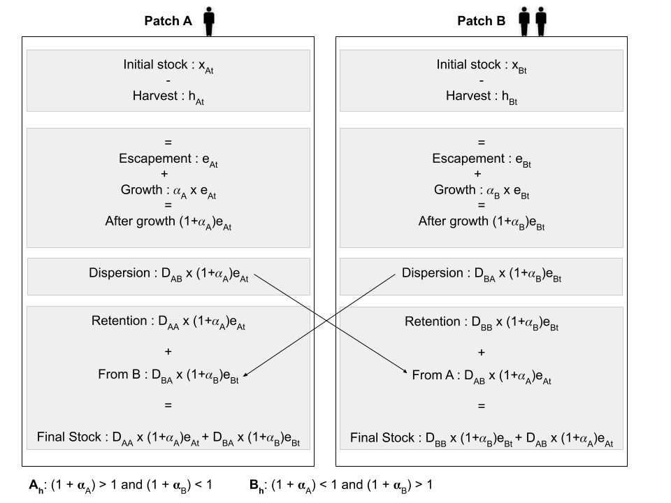
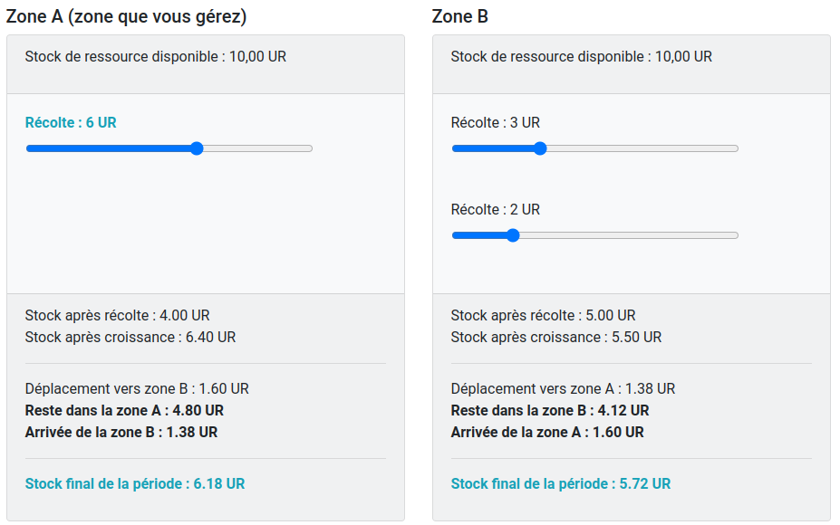
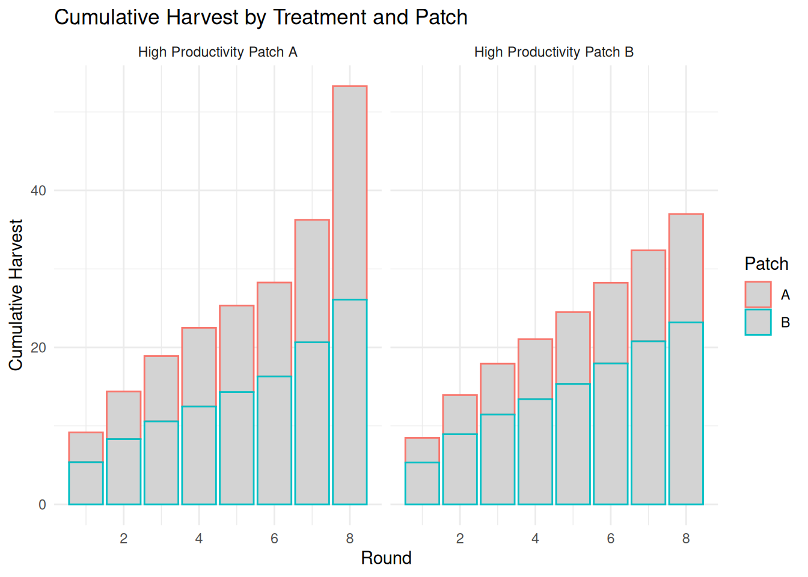
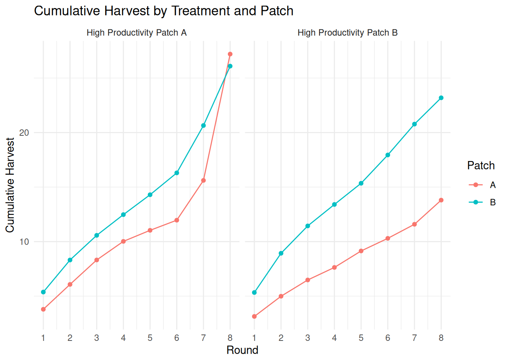
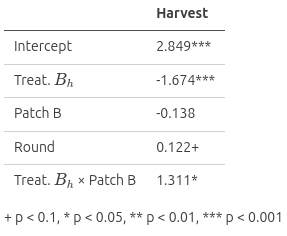
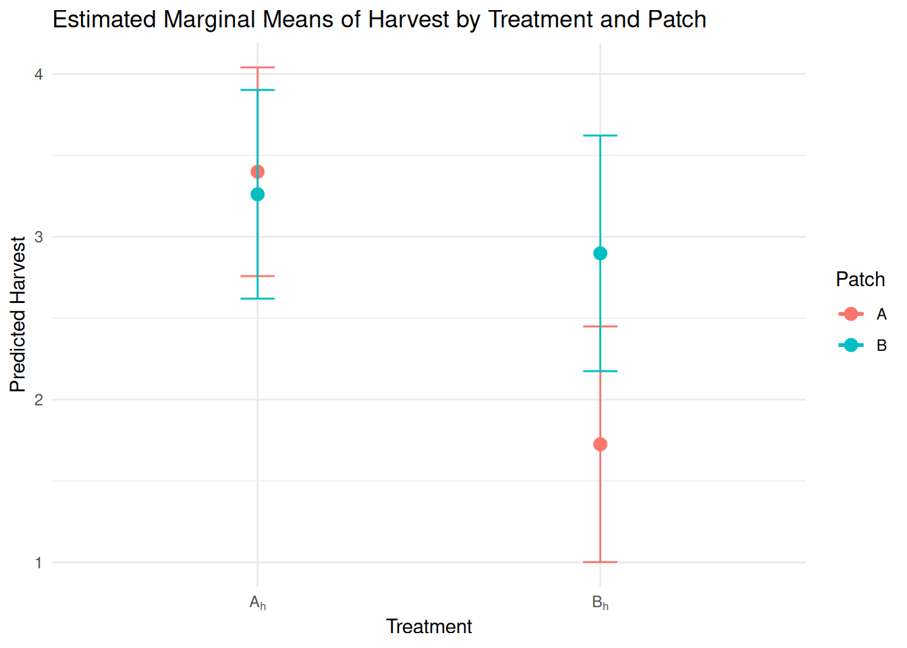
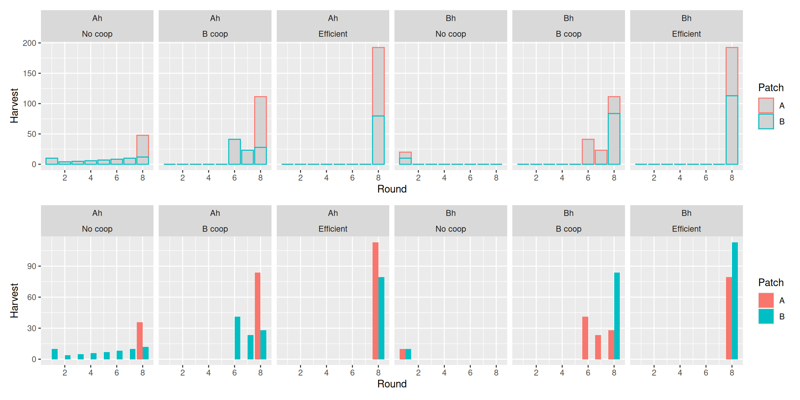

# Managing Mobile Common Pool Resources

### Experimental Evidence on Property Rights and Productivity
G. Bayle, **D. Dubois**, M. Beaud, M. Willinger & N. Quérou
CEE-M, CNRS, Univ. Montpellier, INRAE, Institut Agro

---

## The CramoRes Project

- **CramoRes** is an ANR-funded project  
- Objective: study collective management of **mobile common-pool resources** in a **dynamic and spatially structured context**
- Combines theoretical modeling, experimental economics and behavioral analysis

---

### Common Theoretical Framework

- **Discrete spatial domain**: multiple patches (e.g. A and B)  
- **Discrete time**, finite horizon
- **Resource growth** is local 
- **Resource mobility**: fraction of stock migrates between patches  
- **Terminal condition**: unharvested resource is lost at the end

> This framework derives from Costello, Quérou & Tomini (2015)  
> *Partial Enclosure of the Commons*, JPubE

---

### Research questions

- **Mobility**: How does the degree of inter-patch mobility affect management efficiency? *(Project 1)*  
- **Governance structure**: Is it better to allocate rights to one or multiple managers? *(Project 2)*  
- **Productivity asymmetry**: Should exclusive rights go to the most productive zones? *(Project 3)*  
- **Risk**: What happens when a sudden shock (with some probability) redirects the resource flow permanently? *(Project 4)* 

---

## Focus on Project 3

### Research question

How should **exclusive vs. shared property rights** be allocated in environments with **heterogeneous resource productivity**?

---

### Examples

- **Fisheries**  
  Fish stocks move across exclusive economic zones.  
  Should rich spawning areas be managed exclusively (e.g. ITQs) or collectively across borders?

- **Transboundary groundwater**  
  Aquifers recharge unevenly; water flows across regions.  
  Should pumping rights be concentrated in high-recharge zones?

- *Pastoral systems, Forests and wildlife corridors etc.*

> ➤ Where should **exclusive rights** be allocated when **resources are mobile and productivity is uneven**?

---

## Property Rights and Productivity Allocation

We isolate the effect of **productivity allocation**, keeping property rights fixed:

- The **number of players per patch** defines the property regime:
  - **1 player** → Exclusive rights
  - **2 players** → Shared rights
- These rights remain constant throughout the game (1A - 2B)

We manipulate only the **location of high productivity**:

- *$A_h$*: high productivity in **exclusive** patch (A)
- *$B_h$*: high productivity in **shared** patch (B)

> ➤ Do productive zones perform better under **exclusive or shared** management?

---

## Formal model

- Two interconnected patches: **A** and **B**
- Each patch has a renewable stock: $x_{i,t}$  
- Players choose how much to harvest: $h_{i,t}$
- **Resource dynamics** (growth and mobility):
$$
x_{i,t+1} = D_{ii} \cdot (1 + \alpha_i)(x_{i,t} - h_{i,t}) + D_{ji} \cdot (1 + \alpha_j)(x_{j,t} - h_{j,t})
$$
- $\alpha_i$: growth rate in patch *i*  
- $D_{ii}$: retention, $D_{ji}$: migration from the other patch (dispersion)
- Payoff: $\pi_{i,t} = p \cdot h_{i,t}$ (no harvest cost, $p=1$)

---

### Productivity

- Patch productivity: $Q_i = D_{ii} \cdot (1 + \alpha_i)$
- Productivity reflects *the marginal return from conserving one unit in a patch*

| Productivity | Interpretation                        | Implication             |
|-----------------------------------------------|--------------------------------------|--------------------------|
| $Q_i > 1$                                      | Keeping the resource is more valuable | **Conserve** the resource |
| $Q_i < 1$                                      | Extracting now is more profitable     | **Harvest immediately**  |

---

## Illustration (1/2)

---

## Illustration (2/2)

---

## Efficient vs. Strategic Extraction

- The **efficient path** maximizes total payoff over time:
  - Players should wait, let the resource grow, then harvest everything in the **last period**
  - No extraction in $t < T$, full harvest in $t = T$

- Under **decentralized (non-cooperative)** behavior:
  - Players anticipate others' overharvesting
  - Leads to **early and excessive extraction**

> Strategic behavior creates an intertemporal dilemma  
→ Extract early to preempt rivals and secure payoffs

---

## Impact of Productivity Allocation

- When **high productivity** is managed by a **single player**:
  - She can wait until the last round → behavior close to the efficient path

- When high productivity is managed by **two players**:
  - Lack of coordination → over-extraction from the start
  - Externality affects the other patch through **resource mobility**

---

### Predicted outcome

| Treatment | Behavior in high-prod. patch | Efficiency |
|----------|-------------------------------|------------|
| $A_h$ (exclusive) | Conservation until $t = T$ | Higher |
| $B_h$ (shared)    | Early extraction            | Lower  |

> ➤ **Exclusive rights** in high-productivity areas should lead to better resource management

---

## Experimental Setup

- Laboratory experiment
- Between-subject design with 2 treatments:
  - $A_h$: high-productivity on patch A
  - $B_h$: high-productivity on patch B
- 8 rounds per game
- N = 273 participants &ndash; $A_h$: 153, $B_h$: 120

> *Control tasks: NLE, PGSM, GPS*

---

## Parameters

- Initial stock: 10 units per patch
- $D_{ii}$ = 0.75 &ndash; **Retention**
- $D_{ji}$ = 0.25 &ndash; **Dispersion**
- $(1 + \alpha)_h$ = 1.6 &ndash; **High** productivity ($Q=1.6 \cdot 0.75 = 1.2$)
- $(1 + \alpha)_l$ = 1.1 &ndash; **Low** productivity ($Q=1.1 \cdot 0.75 = 0.825$)

---

## Decision Interface (Player A)

> Only the player's own slider determines their decision. The others simulate teammates' choices.

---

## Cumulative Harvest – Overall Efficiency

Total harvest is **higher in $A_h$** than in $B_h$ &ndash; *Mann-Whitney test p<0.05*

---

## Cumulative Harvest – Distribution by Patch

- Players in **Patch B** extract similar quantities in $A_h$ and $B_h$&ndash; *MW test p=0.663*
- In $B_h$, the player in **Patch A** extracts much less than in $A_h$ &ndash; *MW test p<0.001*

---

## Mixed Model

|  |  |
|:----------------------------:|:-------------------------------------:|

---

- **Intercept**: 2.85 units (p < 0.001) of harvest in treatment $A_h$, Patch A

- **Treatment $B_h$**: −1.67 units (p < 0.001) → Lower harvest when high productivity moves to patch B

- **Patch B**: No significant effect (p = 0.74)

- **Treatment × Patch**: +1.31 units (p = 0.037) → Negative effect of treatment $B_h$ is **mitigated in patch B** (-1.67 + 1.31 = -0.36)

> ➤ The model suggests that treatment $B_h$ reduces harvest, but this effect is moderated in Patch B, where the reduction is less pronounced.

---

## Conclusion

- **Exclusive rights** over high-productivity areas lead to better resource conservation and higher efficiency

- **Shared management leads to early depletion** and propagates negative effects to neighboring patches via resource mobility.

- Effective property rights design must account for **both ecological productivity and strategic behavior**

> ➤ Insights for designing institutional arrangements in mobile CPRs

---

## Thank you

**Contact**: dimitri.dubois@umontpellier.fr  
**Website**: [https://duboishome.info/dimitri](https://duboishome.info/dimitri)

---

## References (1/2)

- Albers, H. J., & Robinson, E. J. Z. (2013). A review of the spatial economics of non-timber forest product extraction: implications for policy. Ecological Economics, 92, 87-95.
- Costello, C., & Polasky, S. (2008). Optimal harvesting of stochastic spatial resources. Journal of Environmental Economics and Management, 56(1), 1-18.
- Costello, C., Querou, N. & Tomini, A. (2015). Partial enclosure of the commons. Journal of Public Economics 121, 69-78.
- Sanchirico, J. N., & Wilen, J. E. (1999). Bioeconomics of spatial exploitation in a patchy environment. Journal of Environmental Economics and Management, 37(2), 129-150.

---

## References (2/2)

- Brozovic, N., Sunding, D. L., & Zilberman, D. (2010). On the spatial nature of the groundwater pumping externality. Resource and Energy Economics, 32(2), 154-164.
- Pfeiffer, L., & Lin, C. Y. C. (2012). Groundwater pumping and spatial externalities in agriculture. Journal of Environmental Economics and Management, 64(1), 16-30.
- Ostrom, E. (1990). Governing the Commons: The Evolution of Institutions for Collective Action. Cambridge University Press.

---

## Numerical Predictions

